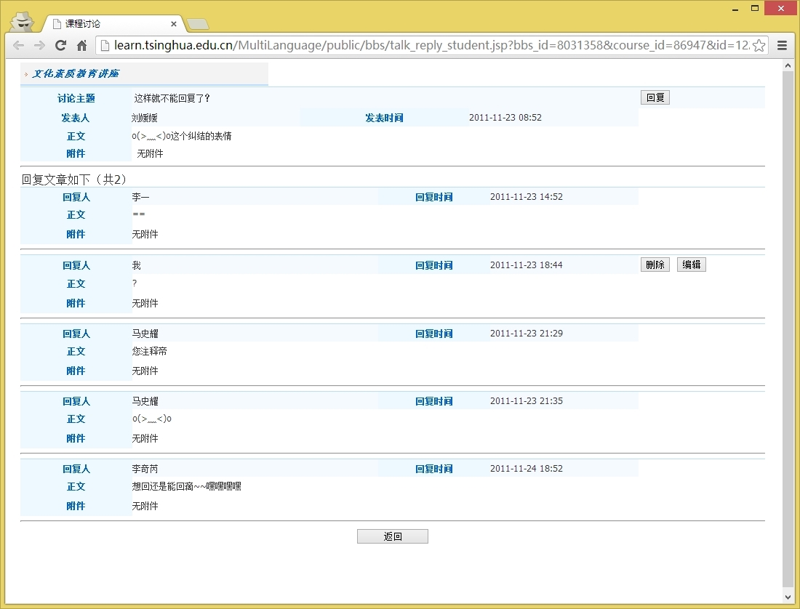



# 课程讨论 JavaScript injection 导致该工具不能下载的临时解决方案

由于网络学堂课程讨论这里不对用户输入过滤, 
所以在文化素质讲座课程讨论这里就被搞出来了一些很奇怪的东西

然后我之前的版本就在这里不能运行下去了

 我目前的解决办法是在[代码这里](https://github.com/tianyang-li/download-tsinghua-wangluoxuetang/blob/v1.5/dl-app/content/wangluoxuetang.js#L672)对特定的课把不让这个工具去下载
 
 要修改 Firefox add-on 的代码可以到[这个地方](https://developer.mozilla.org/en-US/docs/Installing_extensions#Windows)找到 wangluoxuetang.js 根据出错的 course\_id 进行修改

